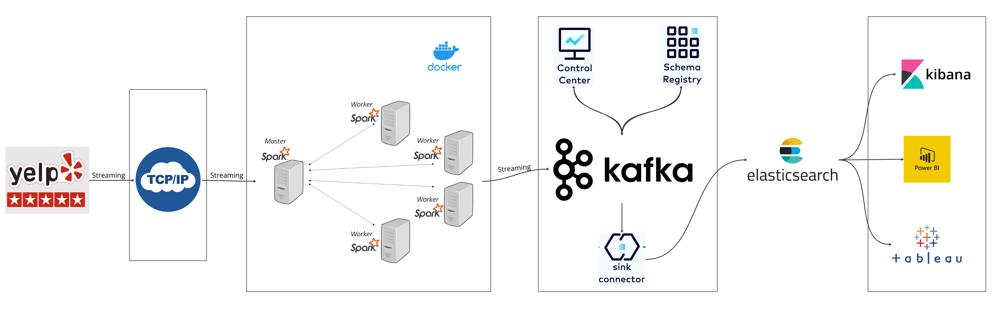

## Real Time Sentiment Analysis with LLama 3.1, Spark Streaming and Kafka

SentimentStream is a real-time sentiment analysis system using Apache Spark, Kafka, and LLMs like LLama 3.1 and OpenAI models for processing customer reviews. It streams data, performs sentiment analysis, and stores the results in Kafka and sends the messages to Elastic Search for further processing.

## System Architecture



## Table of Contents

1. [Prerequisites](#prerequisites)
2. [Project Structure](#project-structure)
3. [Setup](#setup)
4. [Running the Application](#running-the-application)
5. [Monitoring and Debugging](#monitoring-and-debugging)
6. [Customization](#customization)

## Prerequisites

- Docker and Docker Compose
- Python 3.9+
- Apache Spark 3.5.0+
- Confluent Kafka account
- Elastic Search Account
- OpenAI API key or Azure OpenAI/AI Hub credentials

## Project Structure

```
src/
├── config/
│ ├── config.py
│ └── .env.example
├── jobs/
│ ├── spark-streaming.py
│ └── streaming-socket.py
├── schemas/
│ └── reviews.schema.avsc
├── datasets/
│ └── yelp_academic_dataset_review.json
├── Dockerfile.spark
├── docker-compose.yml
├── requirements.txt
└── README.md
```

## Setup

1. Clone the repository:

   ```
   git clone https://github.com/ajosegun/SentimentStream.git
   cd SentimentStream/src
   ```

2. Copy the `.env.example` file to `.env` and fill in your credentials:

   ```
   cp config/.env.example config/.env
   ```

3. Edit the `config/.env` file with your API keys and credentials:

   - OpenAI API key
   - Azure OpenAI credentials (if using)
   - Azure AI Hub credentials (if using)
   - Confluent Kafka credentials

4. Build the Docker images:

   ```
   docker-compose build
   ```

5. Start the Docker containers:
   ```
   docker-compose up -d
   ```

## Running the Application

1. Start the streaming socket (data source):

   ```
   docker exec -it spark-master python jobs/streaming-socket.py
   ```

2. Submit the Spark streaming job:
   ```
   docker exec -it spark-worker spark-submit \
     --master spark://spark-master:7077 \
     --packages org.apache.spark:spark-sql-kafka-0-10_2.12:3.5.0 \
     jobs/spark-streaming.py
   ```

The application will now start processing the streaming data, performing sentiment analysis, and sending the results to Kafka.

## Monitoring and Debugging

- Access the Spark Master UI: http://localhost:9090
- View Kafka topics and messages using Confluent Cloud Console
- Check Docker container logs:
  ```
  docker-compose logs -f
  ```

## Elasticsearch Queries

The project includes sample Elasticsearch queries for analyzing the sentiment data. These queries are stored in the `elastic_search_query.json` file. Here are some example queries:

1. Retrieve all documents:

   ```json
   GET customers_review/_search
   {
     "query": {
       "match_all": {}
     }
   }
   ```

2. Search for reviews containing a specific phrase:

   ```json
   GET customers_review/_search
   {
     "query": {
       "match_phrase": {
         "text": "amazing"
       }
     }
   }
   ```

3. Aggregate sentiment feedback:
   ```json
   GET customers_review/_search
   {
     "size": 0,
     "aggs": {
       "group_by_feedback": {
         "terms": {
           "field": "feedback.keyword"
         }
       },
       "total_count": {
         "value_count": {
           "field": "feedback.keyword"
         }
       }
     }
   }
   ```

These queries can be used to analyze the sentiment data stored in Elasticsearch. You can execute these queries using the Elasticsearch API or a tool like Kibana.

## Customization

1. AI Model Selection:
   You can use either of Azure OpenAI, Azure AI Hub (Access to Open Source Models) or OpenAI.
   In `jobs/spark-streaming.py`, uncomment the desired sentiment analysis function:

   ```python
   sentiment_analysis_udf = udf(sentiment_analysis_azure_ai_hub, StringType())
   # sentiment_analysis_udf = udf(sentiment_analysis_azure_openai, StringType())
   # sentiment_analysis_udf = udf(sentiment_analysis_openai, StringType())
   ```

2. Kafka Topic:
   Change the Kafka topic name in `jobs/spark-streaming.py`:

   ```python
   topic = "customers_review"
   ```

3. Data Source:
   Modify the input file path in `jobs/streaming-socket.py`:

   ```python
   send_data_over_socket("datasets/yelp_academic_dataset_review.json")
   ```

4. Spark Configuration:
   Adjust Spark settings in `docker-compose.yml` for the `spark-worker` service:

   ```yaml
   environment:
     SPARK_WORKER_CORES: 2
     SPARK_WORKER_MEMORY: 1g
   ```

5. Scaling Workers:
   Uncomment additional worker services in `docker-compose.yml` to add more Spark workers.

## Screenshots

1. Kafka Topics on Confluent Cloud (Positive Sentiment)
   

2. Kafka Topics on Confluent Cloud (Negative Sentiment)
   

3. Elastic Search Docs
   

4. Elastic Search Queries
   

5. If you have access to Azure AI Hub, you can view the models available to you.
   

## Troubleshooting

- If you encounter memory issues, try increasing the memory allocation for Docker and the Spark workers.
- Ensure all required environment variables are correctly set in the `.env` file.
- Check firewall settings if you have connection issues between containers or external services.
